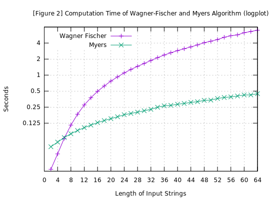

==================================
Wagner-Fischer vs Myers' Algorithm
==================================

:Author: Fujimoto Seiji
:Published: 2020-08-15 
:Updated: 2022-03-12
:Copyright: This document has been placed in the public domain.

.. contents::
   :local:
   :backlinks: none

1. Introduction
===============

This article compares the two most common Levenshtein distance
algorithms.

- Wagner-Fischer Algorithm (1974) [Wagner1974]_
- Myers' Bit-parallel Algorithm (1999) [Myers1999]_

While algorithm selection is corner-stone for program efficiency,
the empirical evidence on which algorithm performs better (and when)
is often limited.

To fill the gap, I did a comparative survey by implementing both
algorithms.

2. Methods
==========

2.1. Implementation
-------------------

I created a C implementation of two algorithms. Some notes on
the implementation:

- The Wagner-Fischer algorithm was optimized using the method
  described in :any:`this article <wagner-fischer/index>`.
  To my knowledge, this is the best generic implementation
  of this algorithm.

- The Myers algorithm was optimized using a method to compact
  the pre-computation from :math:`O(Σ)` to :math:`O(n)`
  (:math:`Σ` is a number of alphabets and :math:`n` is the
  length of input strings). See `this commit`_ for details.

You can download the implementation from :download:`benchmark.c <20200815/benchmark.c>`.

.. _this commit: https://github.com/fujimotos/polyleven/commit/82a08e04

2.2. Test Data
--------------

Test data is random hex strings ranging from 2 characters to
64 characters.

The two algorithms were measured how much time they take to
process 1,000,000 string pairs of each length.

3. Result
=========

The following figure show the result on Intel Xeon(R) E5-2660
(2.60Ghz). The program was compiled using GCC 8.3.0.

As you can see, the Myers algorithm generally performs better
than Wagner-Fischer algorithm.

.. figure:: 20200815/benchmark.svg
   :width: 600

   Comparison of Wagner-Fischer vs Myers Algorithm

The figure 2 below shows the same result using a log scale:

   Comparison of Wagner-Fischer vs Myers Algorithm (logscale)

The "break-even" point seems to be six characters. Longer than
that, Myers's algorithm works better than the Wagner-Fischer
algorithm. Shorter than that, the converse holds true.
