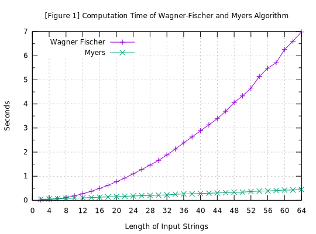
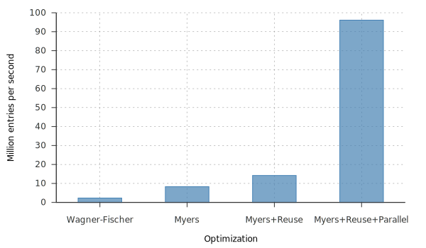

============================================
Fast fuzzy search on 100 million DNA dataset
============================================

:Author: Fujimoto Seiji
:Publish: 2022-05-15
:Copyright: This document has been placed in the public domain.

.. contents:: Table of Contents
   :local:
   :backlinks: none

1. Introduction
===============

In this expository note, I explain how to implement a fast fuzzy search
on a large DNA dataset.

For the convenience of discussion, this article assumes the following
problem structure:

* You have a dataset that contains 100 million DNA fragments.
* The length of each DNA fragment is 20.
* You want to find out every entry whose edit distance to your
  query is :math:`\le N`.

However, you should be able to apply this article's method to other
similar problems as well.

2. The naive solution
=====================

The most simple/naive solution for this problem would be something like
this:

1. Implement the Wagner-Fischer algorithm.
2. Brute-force the dataset to find all the eligible entries.

The basic problem here is that the Wagner-Fischer algorithm only can
process ~3 million DNA pairs per second [1]_.

In short, to handle a dataset of 100 million records, we need to
find a way to speed up the computation 30x.

.. [1] Roughly 2.3m/s on AMD Ryzen 7 4700GE. See the benchmark test
       below for more details.

3. How can we make it faster?
=============================

3.1. Use Myers' Bit parallel algorithm
--------------------------------------

Gene Myers invented an elegant algorithm to compute edit distance.
This algorithm is distinguished from preceding solutions by the
extensive use of `bit-level parallelism <https://en.wikipedia.org/wiki/Bit-level_parallelism>`_.
[Myers1999]_

Practically speaking, Myers' method exceeds the Wagner-Fischer
algorithm across at a wide range of inputs. Here are a benchmark
test that :any:`I've done a while ago <20200815-Comparison>`:

   Time spent to process 1 million string pairs.
   (The lower, the better)

The figure above illustrates the efficiency of two algorithms as a
function of the input lengths.

3.2. Optimize Myers' algorithm
-------------------------------

One of the drawbacks of Myers' algorithm is that it requires the pre-
computation of bit vectors. This pre-computation requires :math:`O(Σn)`
time [2]_ and roughly speaking takes 30-40% of the total computation time.

Luckily we can optimize the pre-computation:

 * There is a much simpler way (than described in the original article) to
   pre-compute the bit vectors. [3]_

 * We can cache the pre-computed bit vectors. So we do not need to compute
   them in each function call.

These optimization (especially the "reuse" part) makes the entire
computation much more efficient.

.. [2] Σ is number of alphabets. n is the length of an input string.
.. [3] For example, here is `how I implemented it in Polyleven <https://github.com/fujimotos/polyleven/blob/master/polyleven.c#L278-L279>`_

3.3. Process-level parallelism
------------------------------

In addition to the bit-level parallelism, we can also use the process-level
parallelism.

Since a vast majority of modern computers have multiple cores, we can
leverage them to speed up the overall throughputs.

In the benchmark test below, I used `GNU parallel <https://www.gnu.org/software/parallel/>`_
to distribute processing to multiple cores, but you should be able to get
similar results with any task distribution tools.

4. Experimental Results
=======================

A benchmark test was done with Ryzen 7 4700GE on Ubuntu 22.04.
The full source code is `available on GitHub. <https://github.com/fujimotos/dna100m>`_

The following table shows the result of the benchmark test.

   Number of million entries per second each method can process
   (The higher, the better)

**Table of Results**

= ====================== =================== =========
# METHOD                 THROGHPUT [input/s] SPEED
= ====================== =================== =========
1 Wagner-Fischer           2.3m per sec         --
2 Myers                    8.3m per sec      **3.6x**
3 Myres+Reuse             14.2m per sec      **6.1x**
4 Myres+Reuse+Parallel    96.1m per sec      **41.7x**
= ====================== =================== =========

5. Future works
===============

5.1. Use computer clusters
--------------------------

As you can see, one half of the improvements came from a better algorithm
(6.1x) and the other half came from applying more CPU cores (6.8x).

The obvious step to speed up the computation further is throwing more
CPU powers. The problem is highly parallelable, so by using a more
performant CPU or distributing the task to multiple computers, we will be
able to handle a dataset of a few billion entries in a couple of seconds.

.. 4.2. GPU Programming
.. --------------------

.. Another approach is leveraging GPU. This is already studied in

.. 4.3. Vectorization
.. ------------------

.. The myers algorithm is basically a banch of bit-wise operations.
.. This seems to be
