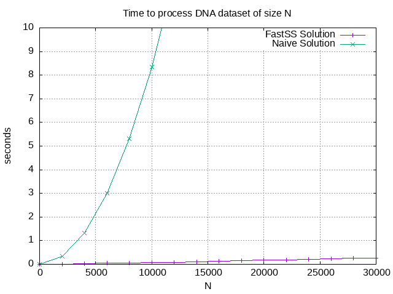

===================================
Find similar pairs of DNA sequences
===================================

:Author: Fujimoto Seiji
:Publish: 2022-11-26
:Copyright: This document has been placed in the public domain.

.. contents:: Table of Contents
   :local:
   :backlinks: none

1. Introduction
===============

Suppose that you have bio dataset that contains 10k DNA sequences.
For research purpose, you want to find every pair in the dataset that
differ only by one character (base-pair). How would you implement it?

Let's restate this problem in a more formal manner:

    Given a dataset containing N DNA sequences, find all pairs
    where Levenshtein distance is at most 1.

This article explores several solutions for this problem.

2. How to solve it?
===================

2.1. Naive solution
-------------------

If :math:`N` is small, you can just compute all the combination of
the DNA sequences. Here is what I have in mind:

.. code-block:: python

   from itertools import combinations
   from polyleven import levenshtein

   # dataset = ["AGCT", "AGTT", ...]
   def naive(dataset):
        for dna1, dna2 in combinations(dataset, 2):
            if levenshtein(dna1, dna2) < 2:
                print(dna1, dna2)

Since we need to compute :math:`N(N-1) \over 2` pairs, this solution
consumes :math:`O(N^2)` time.

2.2. Faster solution (with FastSS)
----------------------------------

The computation time for the previous solution increases quadratically
as :math:`N` gets bigger. It will be not feasible at a certain data size.

The common way to handle this issue is to introduce a clever index
structure that allows to find similar entries quickly. One such data
structure is FastSS [Bocek2007]_.

The basic idea is:

* If two strings is similar enough, they should have a common substring.
  For example, `AGTCA` and `AGTCG` look very *similar*, exactly
  because they share the same prefix `AGTC`.

* This means that, theoretically, you can parittion entries by their
  substrings.  In this scheme, `AGTCA` will be in the same group with
  `AGTCG`, but `TTTGT` won't.

* This partitioning will make the task easy, because you only need to
  evaluate combinations within each group, which contains only a small
  subset of the original dataset.

For details, please read the referenced paper. Here is the simple
implementation of this idea:

.. code-block:: python

   from collections import defaultdict
   from itertools import combinations
   from polyleven import levenshtein

   def make_index(word, max_dist):
       res = set()
       length = len(word)
       for dist in range(min(max_dist, length) + 1):
           variants = combinations(word, length - dist)
           for variant in variants:
               res.add(''.join(variant))
       return res

   def fastss(dataset):
       groups = defaultdict(set)
       for dna in dataset:
           for key in make_index(dna, 1):
               groups[key].add(dna)

       for grp in groups.values():
           for dna1, dna2 in combinations(grp, 2):
               if levenshtein(dna1, dna2) < 2:
                   print(dna1, dna2)

3. Benchmark
============

The following graph shows how much time each solution requires
to process a dataset of size N.

You can see that using a search index reduces the computation time
quite significantly.

4. References
=============

* `fujimotos/kindna <https://github.com/fujimotos/kindna>`_ includes a full
  implementation of the faster solution.
