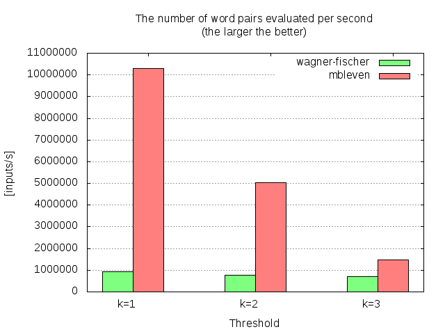

=====================================================
mbleven -- A fast algorithm for bounded edit distance
=====================================================

:Author: Fujimoto Seiji
:Published: 2012-03-01 
:Copyright: This document has been placed in the public domain.

.. contents:: Table of Contents
   :local:
   :backlinks: none

:dfn:`mbleven` is a fast algorithm to compute k-bounded Levenshtein
distance. In general, it's one of the fastest algorithm for cases
where the bound parameter is small (:math:`k < 3`).

1. How fast is it?
------------------

To illustrate the performance characteristic, I conducted a benchmark
test that compares mbleven and :any:`the Wagner-Fischer algorithm <../wagner-fischer/index>`.

The measurement was done by count the time each algorithm takes to
process 4 million binary strings. Here is the graph that shows the
result (on Intel Core i3-4010U with GCC 6.3.0):

The benchmark program is available from :download:`mbleven-benchmark.c <mbleven-benchmark.c>`.
To run this program::

  $ cc -O2 -o mbleven-benchmark mbleven-benchmark.c
  $ ./mbleven-benchmark

2. Implementations
------------------

There are several implementations available.

- `mbleven`_ is the reference implementation written in Python. This implementation also supports Damerau-Levenshtein distance.
- `distance`_ contains a C implementation (See :samp:`fast_comp()` function).
- `polyleven`_ contains another C implementation.

.. _mbleven: https://github.com/fujimotos/mbleven
.. _distance: https://github.com/doukremt/distance
.. _polyleven: https://github.com/fujimotos/polyleven

3. How it works
---------------

mbleven is a *hypothesis-based* algorithm, which means that it solves
the edit distance problem by testing a collection of hypotheses.

Suppose you are trying to compute the distance between :math:`S` and :math:`T` under
the constraint :math:`k = 1`. The mbleven algorithm first enumerates all the
edit operations that are possible under the threshold :math:`k`:

1. Can an insertion transform :math:`S` to :math:`T`?
2. Can a deletion transform :math:`S` to :math:`T`?
3. Can a substitution transform :math:`S` to :math:`T`?

Then, mbleven checks each hypothesis one by one to find out if any
of them holds true.

As explained later, each hypothesis can be verified in :math:`O(n)` time
using :math:`O(1)` space, so it can run quite faster than the common
algorithms that require :math:`O(n^2)` time.

3.1. Efficient Pruning
++++++++++++++++++++++

One important aspect of mbleven is very efficient pruning of search
space. In particular, we can reject most of hypotheses just by
looking at the length of input strings.

Consider the task of computing the edit distance between S = 'foo'
and T = 'bar' under the constraint :math:`k = 1`. We can immediately see
that a substitution is the only hypothesis that we need to check.

Why? It's because 'foo' and 'bar' have the same string lengths
(3 chars), so operations such as "one insertion" or "one deletion"
can't convert one into another.

We can expand this argument to other cases as well. If S = 'foo' and
T = 'fo' with :math:`k=2`, we only need to check "one deletion + one
substitution". If S = 'foobar' and T = 'bar' with :math:`k=3`, we just need
to test "three deletions".

3.2. Verification Algorithm
+++++++++++++++++++++++++++

As mentioned above, each hypothesis can be verified in :math:`O(n)` time.
The following code shows how the verification can be done:

.. code-block:: python

    def check_model(s, t, model):
        m = len(s)
        n = len(t)
        k = len(model)
        i, j, c = 0, 0, 0
        while (i < m) and (j < n):
            if s[i] != t[j]:
                if k <= c:
                    return c + 1
                if model[c] == 'd':  # deletion
                    i += 1
                elif model[c] == 'i':  # insertion
                    j += 1
                elif model[c] == 'r':  # replacement/substitution
                    i += 1
                    j += 1
                c += 1
            else:
                i += 1
                j += 1
        return c + (m - i) + (n - j)

This function returns the number of the operations it consumed to
convert :math:`S` into :math:`T`. If the return value is greater
than :math:`k`, it means that the specified model cannot transform
:math:`S` into :math:`T`.

As you can see, each iteration of the while loop increments i or j,
so the main loop will break after at most :math:`n + m` steps. Thus, this
function runs in linear time to the length of the input strings.
